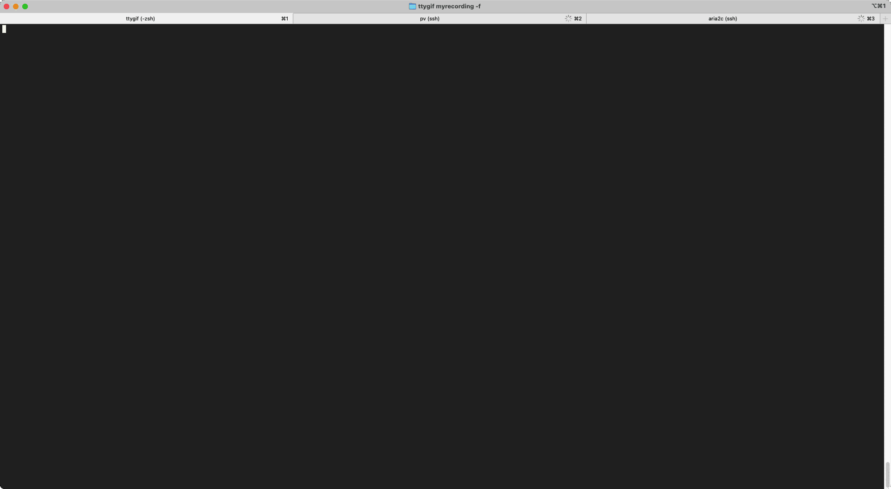

## 我的neovim配置

<!--  -->


### 使用方法

- 1. 配合 https://github.com/lesssound/dotfiles 使用
- 2. 独立使用

        ```sh
        mkdir ~/.dotfiles
        https://github.com/lesssound/nvim-config ~/.dotfiles
        cd ~/.dotfiles
        sh ./installer.sh
        ```


### QA
- 不能连接GitHub时
    ```sh
    # linux
    sed -i s/github.com\\//github.com.cnpmjs.org\\// autoload/plug.vim

    # mac
    brew install gnu-sed
    gsed -i s/github.com\\//github.com.cnpmjs.org\\// autoload/plug.vim
    ```

<!-- vi vimrcs/plugins.vim -->
<!-- vi plugins/plugin_lsp.vim -->
<!-- %s/Plug\ \'/Plug \ \'https\:\/\/hub\.fastgit\.org\//g -->


<!-- #### in arch/manjaro use cliopboard -->
<!-- ```sh -->
<!-- [> sudo pacman -Sy xclip xorg-xclipboard <] -->
<!-- sudo pacman -Sy xsel -->
<!-- ``` -->
<!-- > reference from [ma6174](https://github.com/ma6174/vim-deprecated) and [Coc-extensions](https://github.com/neoclide/coc.nvim/wiki/Using-coc-extensions) -->
